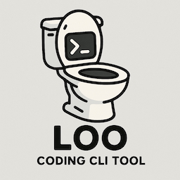

An LLM-based coding CLI that acts as a bridge between AI reasoning and filesystem/command-line tools.

## Project Structure

The LOO CLI is organized into modular components for maintainability and extensibility:

```
src/
├── main.rs           # Application entry point and CLI orchestration
├── cli/              # Command-line interface definitions
│   └── mod.rs        # CLI structure and command definitions using clap
├── config/           # Configuration management
│   └── mod.rs        # TOML configuration loading, saving, and validation
├── openrouter/       # OpenRouter API integration
│   └── mod.rs        # API client, request/response types, and tool definitions
├── tools/            # Tool execution engine
│   └── mod.rs        # Filesystem and command execution handlers
└── engine.rs         # Core orchestration engine
```

## Module Responsibilities

### `cli/` - Command Line Interface
- Defines CLI commands and arguments using clap
- Handles command parsing and validation
- Provides help text and usage information

### `config/` - Configuration Management
- TOML configuration file parsing and generation
- Environment variable integration
- Configuration validation and error handling
- Cross-platform config directory management

### `openrouter/` - LLM Integration
- OpenRouter API client with authentication
- Request/response type definitions
- Tool schema generation for OpenAI function calling
- Async HTTP communication handling

### `tools/` - Tool Execution
- Filesystem operations (create, read, write, delete files/directories)
- Shell command execution with output capture
- Context querying and project state management
- Error handling and result formatting

### `engine.rs` - Core Engine
- Orchestrates interaction between LLM and tools
- Manages conversation state and message history
- Handles tool call execution and response formatting
- Implements the main conversation loop

## Features

### Configuration Management
- **File-based config**: `~/.config/loo/config.toml` (Linux/macOS) or `%APPDATA%\loo\config.toml` (Windows)
- **Environment variables**: Override config with `OPENROUTER_API_KEY`, `OPENROUTER_MODEL`
- **CLI arguments**: Runtime overrides with `--model`, `--verbose`, etc.

### OpenRouter Integration
- **Native tool calling**: Uses OpenRouter's function calling for seamless LLM-tool integration
- **Model selection**: Support for any OpenRouter-compatible model
- **Authentication**: Secure API key management
- **Error handling**: Comprehensive error handling and retry logic

### Tool System
- **Filesystem tools**: Complete file and directory operations
- **Command execution**: Shell command running with full output capture
- **Context awareness**: Project state querying and workspace introspection
- **Safety**: Sandboxed execution within working directory

## Usage

### Basic Commands

```bash
# Initialize configuration
loo config init

# Set your OpenRouter API key
loo config set openrouter.api_key "sk-or-v1-your-key-here"

# Set default model
loo config set openrouter.model "anthropic/claude-3.5-sonnet"

# Start a coding session
loo start "Build a simple web server in Rust"

# Start with specific working directory
loo start "Refactor authentication module" --dir /path/to/project

# Use a different model for this session
loo start "Create unit tests" --model "meta-llama/llama-3.1-70b-instruct"

# Enable verbose output
loo start "Debug the login issue" --verbose
```

### Configuration Commands

```bash
loo config init      # Initialize default configuration
loo config get       # Display current configuration
loo config set <key> <value>  # Update configuration value
loo config validate  # Validate configuration
```

### Available Configuration Keys

- `openrouter.api_key` - Your OpenRouter API key
- `openrouter.model` - Default model to use
- `openrouter.base_url` - API base URL (advanced)
- `preferences.default_directory` - Default working directory
- `preferences.verbose` - Enable verbose output by default
- `preferences.auto_confirm` - Auto-confirm dangerous operations
- `tools.filesystem` - Enable filesystem tools
- `tools.commands` - Enable command execution tools
- `tools.git` - Enable git-related tools
- `tools.command_timeout` - Command timeout in seconds

## Development

### Building

```bash
cargo build
```

### Testing

```bash
cargo test
```

### Running

```bash
# Development build
cargo run --bin loo -- start "Your project description"
```

## Architecture Benefits

### Modularity
- **Separation of concerns**: Each module has a single, well-defined responsibility
- **Testability**: Individual components can be tested in isolation
- **Maintainability**: Changes to one component don't affect others

### Extensibility
- **New tools**: Easy to add new tool types in the `tools/` module
- **New backends**: Can add alternative LLM providers alongside OpenRouter
- **New commands**: Simple to add new CLI commands in the `cli/` module

### Safety
- **Error handling**: Comprehensive error handling at each layer
- **Type safety**: Strong typing throughout with Rust's type system
- **Sandboxing**: Tool execution is contained within working directory

### Performance
- **Async operations**: Full async/await support for LLM API calls
- **Parallel execution**: Can execute multiple tools concurrently
- **Resource management**: Proper resource cleanup and connection pooling

This modular architecture makes LOO CLI a robust, maintainable, and extensible platform for LLM-driven development workflows.